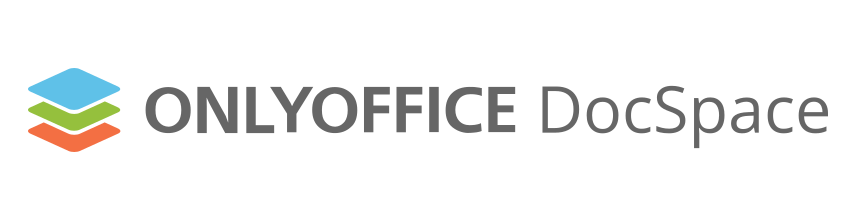
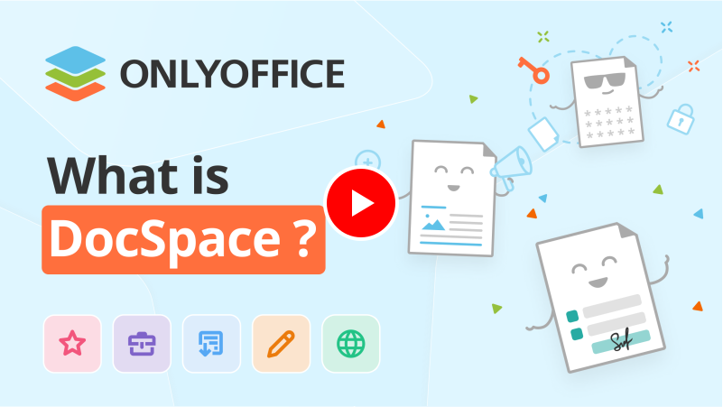

[](https://github.com/ONLYOFFICE/DocSpace/releases)
[](https://opensource.org/license/agpl-v3)
[](https://star-history.com/#ONLYOFFICE/DocSpace)
[](https://github.com/ONLYOFFICE/DocSpace/issues)
[](https://x.com/only_office)
[](https://www.youtube.com/user/onlyofficetv)
[](https://discord.com/invite/Hcgtf5n4uF)

## Overview

ONLYOFFICE DocSpace is a document hub where you can connect users and documents in one place to boost collaboration.

<a href="https://www.youtube.com/watch?v=DU14HFeZErU&ab_channel=ONLYOFFICE" target="_blank"></a>

## Functionality

- 🚪 Various room types: Public rooms, Form filling rooms, Collaboration rooms, Virtual Data Rooms, Custom rooms.
- 🔑 Flexible access permissions: viewing, commenting, reviewing, form filling, editing.
- 📄 Ability to work with multiple file formats: text documents, spreadsheets, presentations, digital forms, PDFs, e-books, media files (images, video and audio files), markdown files.
- 🤝 Document collaboration: two co-editing modes, track changes, comments, built-in chat, plugins for making audio and video calls.
- ☁️ Connecting third-party clouds and storages.
- 💻 JavaScript SDK for embedding ONLYOFFICE DocSpace or its parts into your own web application.
- 🧩 Plugins SDK for creating own plugins and adding them to DocSpace.
- 🧑‍🤝‍🧑 LDAP settings for importing users and groups from an LDAP server.
- 🛡️ Single Sign-On (SSO) settings for enabling third-party authentication using SAML.
- 🛠️ Developer tools: webhooks, OAuth applications, API keys.
- 🔒 Security tools: two-factor authentication, backup and restore features, IP security, audit trail, and much more.
- 🚚 Migration from other platforms, such as Google Workspace, Nextcloud, ONLYOFFICE Workspace.
- 🔌 Ready-to-use connectors for integration with your platform: Drupal, Pipedrive, WordPress, Zapier, Zoom. `<a href="https://www.onlyoffice.com/all-connectors.aspx" target="_blank">`See all connectors`</a>`

## Technology stack

Backend: C# 13.0, .NET 9.0, ASP.NET Core, MySQL 8.3, RabbitMQ, Redis, OpenSearch

Frontend: ES6, TypeScript, React, Mobx, Styled-Components, CSS/SASS, i18next, Webpack 5, Next.js

## Recommended System Requirements

- 💾 RAM: 8 GB or more
- 💻 CPU: dual-core 2 GHz or higher
- 🔄 Swap: at least 2 GB
- 💽 HDD: at least 40 GB of free space
- 🐳 Docker: version 25.2.0 or later
- 🐳 Docker Compose: version 2.28.0 or later

## Simple Building and Running Test Example in Docker

> **Note:** DO NOT USE THIS VERSION IN PRODUCTION ENVIRONMENTS.
> The following instructions create a **development/testing environment**
> not suitable for production use. For production deployment, see:
> [Production Version of ONLYOFFICE DocSpace](https://github.com/ONLYOFFICE/DocSpace-buildtools/tree/master/install/OneClickInstall)

1. Clone the DocSpace repository with submodules:

```bash
git clone --recurse-submodules https://github.com/ONLYOFFICE/DocSpace && \
cd "$(basename "$_" .git)" && \
git submodule foreach "git checkout master"
```

2. Run Docker Images:

```bash
# Change the directory to the docker directory
cd ./docker
# Make sure to run the below command from the ./docker/ directory,
# so the .env file is used for configuration.
docker compose -f dev.docspace.yml up -d
```

3. Open your web browser (Chrome, Opera, etc.) and run: http://localhost

## Production Version

For production deployments, use the official enterprise-ready solutions:

ONLYOFFICE DocSpace Enterprise Edition - Commercial version with enterprise support

ONLYOFFICE DocSpace Developer Edition - Commercial version for integration into any commercial software, under your own brand and on your own servers

[Official Production Documentation](https://www.onlyoffice.com/download.aspx#docspace-enterprise)

## Licensing

ONLYOFFICE DocSpace is released under AGPLv3 license. See the LICENSE file for more information.

## Project info

Official website: [https://www.onlyoffice.com](https://www.onlyoffice.com/?utm_source=github&utm_medium=cpc&utm_campaign=DocSpace "https://www.onlyoffice.com/?utm_source=github&utm_medium=cpc&utm_campaign=DocSpace")

API documentation: [https://api.onlyoffice.com](https://api.onlyoffice.com)

Code repository: [https://github.com/ONLYOFFICE/DocSpace](https://github.com/ONLYOFFICE/DocSpace)

## User feedback and support

If you face any issues or have questions about ONLYOFFICE DocSpace, use the Issues section in this repository or visit our [official forum](https://forum.onlyoffice.com/).
